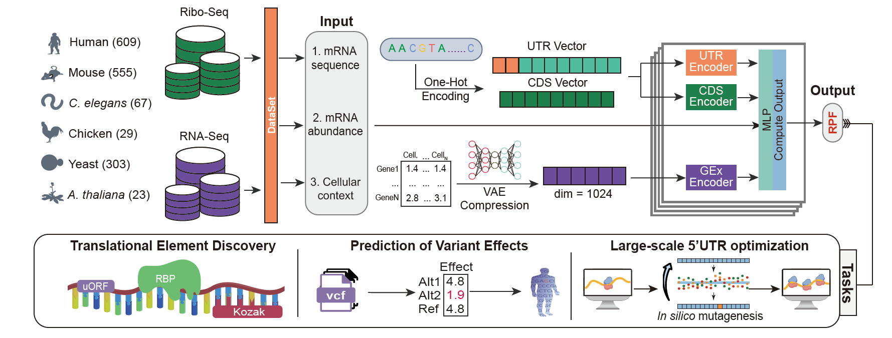

# UTR-CODE


<p>
    <a href="https://opensource.org/licenses/MIT">
        
    </a>
</p>

## 📣 Introduction
___
Translation is a fundamental biological process that directly influences protein abundance, yet the mechanisms by which mRNA sequences determine translational regulation remain incompletely understood, especially the 5’ untranslated regions (5' UTRs) play an essential role in translation regulation. Here, we generated 1,586 paired RNA-seq and Ribo-seq datasets from six species and developed a deep learning model UTR-CODE, to predict mRNA translation efficiency (TE). UTR-CODE demonstrates strong cross-species generalizability and outperforms existing tools across diverse platforms. 



## 🔰 Installation

Download the [training raw data](https://doi.org/10.6084/m9.figshare.30153784.v1) from figshare 
```shell
git clone https://github.com/UTR-CODE/UTR-CODE
cd UTR-CODE
pip install -r requirements.txt

```


# 📝 Usage


##  Training  model
You can train the UTR-CODE  with the simple example.
```shell
python train_encryption.py
```


## ✨ Applications
we provide web server 
### 1. Predicted TE from single mRNA sequence
```shell
cd script
python Pred_single.py --weights epochs/best.epoch \
--utr5 GCTACGATCGATCGATCGACTAG \
--utr3 CCACAACCACTGAGT \
--cds CGTACGCTAGCTAGCAT 
```
### 2. Predicted TE from batch mRNA sequence
```shell
cd script
python script/Pred_batch.py --file batch_mRNA.csv --output batch_mRNA.result.csv

```

### 3. Optimize 5'UTR sequence
```shell
python ISM.py --weights epochs/best.epoch \
--utr5 GCTACGATCGATCGATCGACTAG \
--utr3 CCACAACCACTGAGT \
--cds CGTACGCTAGCTAGCAT 
```


### Advanced
If users want train UTR-CODE with custom data, we provide the [tutorial](script/prepare_Data.md) prepare input data.

## 😉 Author
UTR-CODE are maintained by: * [@HeXin](https://github.com/TcbfGroup)


For more Help, Please leave a message in the issue, 
I will reply as soon as possible.


## 📃 License

MIT 